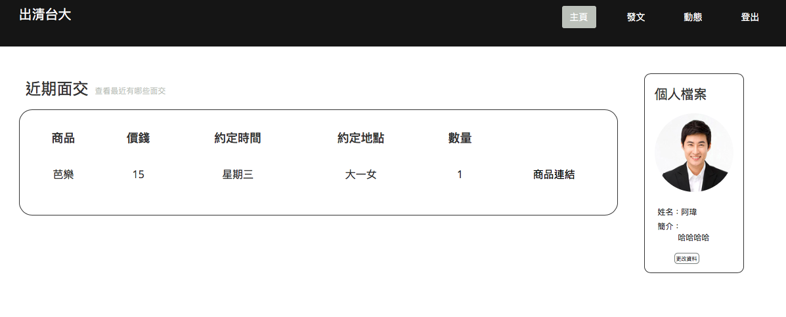

# Database-final 出清台大2.0
使用HTML,CSS,Javascript,PHP,MySQL實作拍賣網站

靈感來⾃於⼀個FB的社團「出清台⼤」，這個平台讓賣⽅上傳想賣的東⻄、讓買⽅可以檢視賣⽅的商品，並在留⾔區留下「排」表達⾃⼰對商品的興趣，⽽⼀般來說，成交的買賣雙⽅會⾃⾏約在台⼤附近⾯交，但有些時候買賣雙⽅會因為時間、地點有⼀些交易上的爭執。此project即是想把這個平台的功能，結合這堂課所學的資料庫，
實作成⼀個媒合買賣雙⽅的網站，藉由功能的改進與新增，希望在減少買賣雙⽅在⾯交時不必要的衝突以外，也能給予買賣雙⽅良好的使⽤者體驗。

Demo圖片：
個人頁面（可查看貼文、已排商品）

動態（可查看賣家貼文）

貼文頁面

管理貼文頁面
